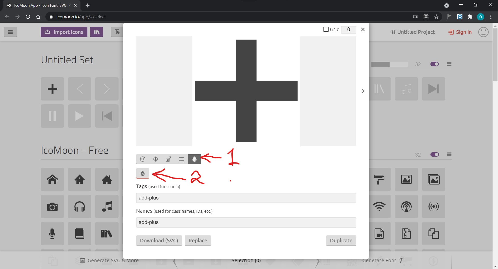

<!-- START doctoc generated TOC please keep comment here to allow auto update -->
<!-- DON'T EDIT THIS SECTION, INSTEAD RE-RUN doctoc TO UPDATE -->

- [Curso de Flexbox Layout y Componentes](#curso-de-flexbox-layout-y-componentes)
  - [Convenciones de nombres populares en CSS](#convenciones-de-nombres-populares-en-css)
    - [BEM](#bem)
    - [SuitCSS](#suitcss)
    - [Otras convenciones](#otras-convenciones)
  - [Convenciones para este curso](#convenciones-para-este-curso)
    - [Convenciones generales](#convenciones-generales)
    - [Convenciones CSS](#convenciones-css)
  - [Flexible Box Layout Module](#flexible-box-layout-module)
    - [Flexbox Containers](#flexbox-containers)
  - [Flex Layout Box Model](#flex-layout-box-model)
  - [Orden y dirección](#orden-y-direcci%C3%B3n)
    - [Flex Order](#flex-order)
    - [Flex Direction](#flex-direction)
  - [Flex Lines](#flex-lines)
    - [nowrap](#nowrap)
    - [wrap](#wrap)
    - [wrap-reverse](#wrap-reverse)
  - [Flexibilidad](#flexibilidad)
    - [FLEX-GROW](#flex-grow)
    - [FLEX-SHRINK](#flex-shrink)
    - [FLEX-BASIS](#flex-basis)
    - [FLEX](#flex)
  - [Alineamiento](#alineamiento)
    - [justify-content](#justify-content)
    - [align-items](#align-items)
  - [Estilos para iconos.](#estilos-para-iconos)
  - [Truncar texto](#truncar-texto)

<!-- END doctoc generated TOC please keep comment here to allow auto update -->

# Curso de Flexbox Layout y Componentes

Apuntes

## Convenciones de nombres populares en CSS

### BEM

> Block Element Modifier

Bloque: `<ul></ul>`
Elemento: `<li></li>`
Modificador: algun estado especifico del elemento

Ejemplo:

- .block
- .block\_\_element
- .block\_\_fancy-element
- .block\_\_element--modifier

### SuitCSS

Se trabaja con PascalCase en el primer bloque y en el segundo con camelCase.

Ejemplo:

- MyComponent
- MyComponent-part
- myComponent-anotherPart
- myComponent--modifier
- is-state
- u-utility

### Otras convenciones

- BEM
- SuitCSS
- SMACSS
- AtomicCSS

## Convenciones para este curso

### Convenciones generales

- No se escribirán estilos globales a excepción de las configuraciones y theme de la aplicacion.
- Las clases serán basadas en componentes y no se deberán repetir.
- Una hoja de estilos por componente.
- Los componentes no deben tener dependencias externas.
- Los archivos se escribirán kebab-case.

### Convenciones CSS

- .component
- .myComponent
- .myComponent-part
- .myComponent-anothePart
- .is-state

## Flexible Box Layout Module

### Flexbox Containers

- display: flex;
- display: inline-flex;

## Flex Layout Box Model

Hay dos tipos de ejes, eje principal y eje transversal

- El eje principal es la dirección en la que ordenamos nuestros flexibles

## Orden y dirección

### Flex Order


Para lograr el resultado anterior necesitamos tres flex containers:

```html
<div class="flexOrder">
  
  <p>
    Lorem ipsum dolor sit amet consectetur adipisicing elit. Ipsum porro ducimus
    minima fuga debitis itaque eligendi quis ea officia odio commodi beatae
    omnis aliquid ratione amet cum, labore nisi minus.
  </p>
</div>
<div class="flexOrder">
  
  <p>
    Lorem ipsum dolor sit amet consectetur adipisicing elit. Ipsum porro ducimus
    minima fuga debitis itaque eligendi quis ea officia odio commodi beatae
    omnis aliquid ratione amet cum, labore nisi minus.
  </p>
</div>
<div class="flexOrder">
  
  <p>
    Lorem ipsum dolor sit amet consectetur adipisicing elit. Ipsum porro ducimus
    minima fuga debitis itaque eligendi quis ea officia odio commodi beatae
    omnis aliquid ratione amet cum, labore nisi minus.
  </p>
</div>
```

En CSS le daremos un display flex y un gap de 5rem, para el párrafo flex item usaremos una propiedad llamada order, que nos permitira ese efecto de sigzag en los flex items. Como algo adicional daremos un border radius de 50% a las imagenes

```css
.flexOrder {
  display: flex;
  gap: 5rem;
}

.flexOrder:nth-child(even) p {
  border: 1px solid red;
  order: -1;
}

.flexOrder img {
  border-radius: 50%;
}
```

### Flex Direction

La propiedad CSS flex-direction especifica cómo colocar los objetos flexibles en el contenedor flexible definiendo el eje principal y la dirección (normal o al revés)

```css
/* La dirección de los items se presenta en una línea */
flex-direction: row;
```


```css
/* Como <row>, pero al revés */
flex-direction: row-reverse;
```


```css
/* Los items se van apilando */
flex-direction: column;
```


```css
/* Como <column> pero al revés */
flex-direction: column-reverse;
```


## Flex Lines

La propiedad flex-wrap especifica si los flex-items son obligados a permanecer en una misma linea o pueden fluir en varias lineas. Tambien permite controlar la dirección en la cual serán apilados los flex-items

Los valores que puede tomar flex-wrap son:

```css
flex-wrap: nowrap
flex-wrap: wrap
flex-wrap: wrap-reverse
```

### nowrap

Los elementos flex son distribuidos en una sola línea, lo cual puede llevar a que se desborde el contenedor flex.

### wrap

Los elementos flex son colocados en varias líneas.

### wrap-reverse

Actúa como wrap pero cross-start y cross-end están intercambiados.

## Flexibilidad

### FLEX-GROW

Es el factor de crecimiento.
Define la abilidad de crecer de un flex item si es necesario.
Su valor por defecto es 0. NO se aceptan valores negativos

Si todos los items tienen un flex-grow de 1, el espacio sobrante del contenedor será distribuido equitativamente a todos los hijos. Si uno de los hijos tiene un valor de 2, este ocuparía el doble de espacio que los demás.

### FLEX-SHRINK

Factor de reducción.
Este define la habilidad de un elemento flexible de encogerse si es necesario.

Su valor por defecto es 1. NO se aceptan valores negativos

### FLEX-BASIS

Define el tamaño por defecto de un elemento flexible antes de que el espacio restante sea repartido, es en relación a la linea del flex container. Es decir, si la caja tiene flex-direction de row, flex-basis representa el width o inline-size, pero si la caja tiene flex-direction de column, flex-basis representa el height o block-size.

Su valor por defecto es `auto`

### FLEX

Es un shorthand para las ultimas 3 propiedades, se declara en el siguiente orden:

flex-grow | flex-shrin | flex-basis

## Alineamiento

### justify-content

Define la alineación a lo largo del eje principal. Ayuda a distribuir el espacio libre sobrante cuando todos los elementos flexibles de una linea son inflexibles, o son flexibles pero ahan alcanzado su tamaño máximo.


### align-items

Define el comportamiento por defecto de la disposición de los elementos flex a lo largo del eje transversal en la línea actual.


## Estilos para iconos.

Existen varias maneras de agregar iconos a una página web, la más facil es usando la etiqueta 

```html

```

Otra manera de hacerlo es usando css, creando una clase para cada icon.
Ademas de crear otro selector para darle un display de inline-block y un ancho y alto.

```css
[class^="icon-"],
[class*=" icon-"] {
  display: inline-block;
  inline-size: 50px;
  block-size: 50px;
  background-size: cover;
}

.icon-home {
  background-image: url("../images/icons/home.svg");
}
```

Pero hay inconvenientes con estos dos métodos, asi que lo que haremos en el curso es convertir nuestros iconos en una fuente usando una herramienta llamada [icomoon.io](https://icomoon.io/app).


Primero tenemos que importar todos nuestros iconos, una vez hecho esto, como nuestros iconos tienen un color blanco, lo que vamos a hacer es quitarlo para nosotros dar el color en CSS. Para esto damos click en el boton de Edit y seleccionamos nuestro icono.



Una vez hecho esto con todos nuestros iconos damos clic en el boton de la parte inferior que dice **_*Generate Font*_** y despues en **_*Download*_**. Descomprimimos el aarchivo resultante, copiamos la carpeta _fonts_ en la raiz de nuestro proyecto y el archivo _style.css_ (Donde estan las clases que podremos usar para usar los iconos) en nuestra carpeta de estilos.

Ahora si, podemos usar nuestros iconos en nuestro proyecto :)

## Truncar texto

Si queremos algun texto dentro de nuestra página tenga esta apariencia:


Es decir, que si sobrepasa el contenedor, este se oculte, tenemos que hacer lo siguiente:

A nuestro texto lo vamos a envolver con una etiqueta span con clase ellipsis

```html
<span class="ellipsis">
  <a href="#" class="link">
    Lorem ipsum dolor sit amet consectetur adipisicing elit. Delectus aut iusto
    atque?
  </a>
</span>
```

Hecho esto, en la clase elipsis vamos a usar un selector para todo lo que tenga dentro de la clase elipsis y aqui es donde sucede la magia

```css
.ellipsis > * {
  display: block;
  white-space: nowrap;
  overflow: hidden;
  text-overflow: ellipsis;
}
```

Aqui usamos estas propiedades, te explico porqué:

- `display: block` - Esta la usamos para que nuestros elementos tengan un ancho y alto

- `white-space: nowrap` - Esto hace que nuestro texto sobresalga de contenedor en caso de que sea demasiado largo

- `overflow: hidden` - Para ocultar el texto que sobresale del contenedor

- `text-overflow: ellipsis` - Esta propiedad es la que hace la magia, nos pone esos tres puntitos suspensivos al final del texto que hace que tenga ese efecto de que el texto es demasiado largo para mostrarse
